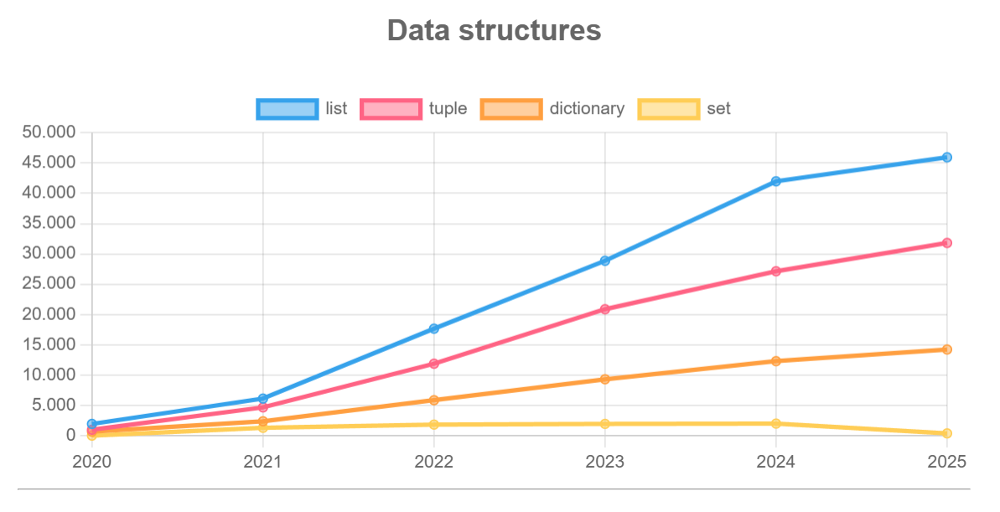

# Explorando evolução de código

Neste exercício, iremos explorar a evolução de código em sistemas reais.

Iremos utilizar a ferramenta [GitEvo](https://github.com/andrehora/gitevo).
Essa ferramenta analisa a evolução de código em repositórios Git nas seguintes linguagens: Python, JavaScript, TypeScript e Java.

Você deve submeter via Moodle apenas o link do seu `fork`, conforme descrito abaixo.

# Passo 1: Selecionar repositório a ser analisado

Selecione um repositório relevante na linguagem de sua preferência (Python, JavaScript, TypeScript ou Java).
Você pode encontrar projetos interessantes nos links abaixo:

- Python: https://github.com/topics/python?l=python
- JavaScript: https://github.com/topics/javascript?l=javascript
- TypeScript: https://github.com/topics/typescript?l=typescript
- Java: https://github.com/topics/java?l=java

# Passo 2: Instalar e rodar a ferramenta GitEvo

Instale a ferramenta [GitEvo](https://github.com/andrehora/gitevo) com o comando:

```
pip install gitevo
```

Rode a ferramenta no repositório selecionado através do seguinte comando (dependendo da linguagem do projeto que escolheu):

```shell
# Python
$ gitevo -r python <git_url>

# JavaScript
$ gitevo -r js <git_url>

# TypeScript
$ gitevo -r ts <git_url>

# Java
$ gitevo -r java <git_url>
```

Onde `<git_url>` é URL do repositório a ser analisado.
Por exemplo, para analisar o projeto Flask escrito em Python:

```
$ gitevo -r python https://github.com/pallets/flask
```

# Passo 3: Explorar os gráficos de evolução de código (`index.html`)

Ao rodar a ferramenta [GitEvo](https://github.com/andrehora/gitevo), o arquivo `index.html` é gerado com diversos gráficos de evolução de código.

Abra o arquivo `index.html` e observe com atenção os gráficos gerados.

# Passo 4: Explicar um gráfico de evolução de código

Selecione um dos gráficos de evolução e explique-o com suas palavras.
Por exemplo, você pode:

- Detalhar a evolução ao longo do tempo, 
- Detalhar se as curvas estão de acordo com boas práticas,
- Explicar grandes alterações nas curvas,
- Explorar a documentação do repositório em busca de explicações para grandes alterações
- Etc.

Seja criativo!

# Exercício

Para responder este exercício, primeiramente, você deve fazer um `fork` deste repositório.
No Moodle, você deve submeter apenas a URL do seu `fork`.

Em seguida, adicione o arquivo gerado `index.html` no seu fork.

Por fim, responda as questões abaixo no seu `fork`: 

1. Repositório selecionado: https://github.com/huggingface/transformers

2. Gráfico selecionado: Data Structures

  
3. Explicação: O gráfico aponta a evolução das estruturas de dados Python no repositório Transformers, do Hugging Face.

Todas as estruturas tiveram comportamento uniforme ao longo dos anos, em geral. Todas tiveram aumento de uso ao longo do tempo (uma clara consequência do aumento de linhas de código), a não ser "set", que teve sua frequência diminuída de 2024 para 2025.

É interessante apontar que a ordem de preferência das EDs nunca mudou: sempre foi, do mais para o menos usado, list, tuple, dict e set. 